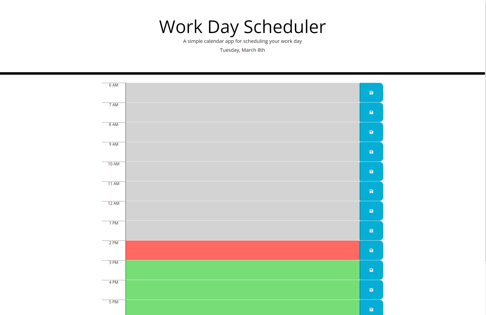

# Work Day Scheduler Code

Created time slots in HTML to enter text and matched IDs to CSS.

Created functions in JS to push text info to localStorage.

Created values to pull from localStorage.

Properly linked CSS/JS to HTML.

